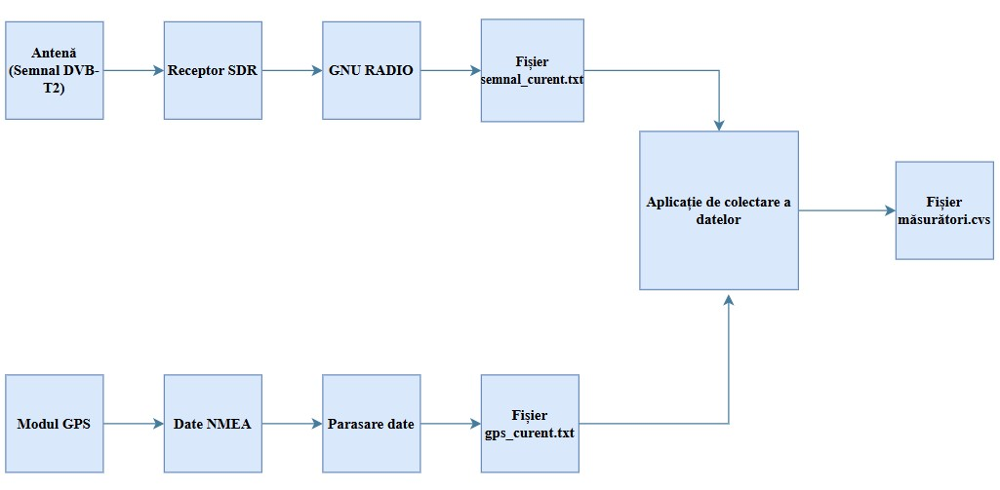
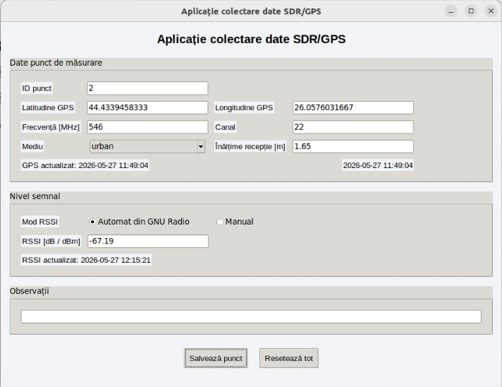
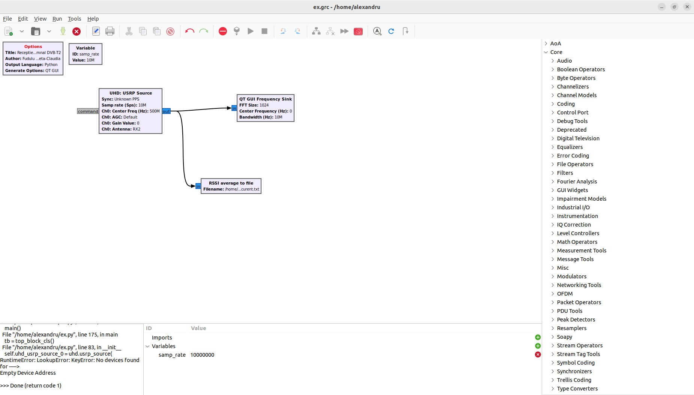
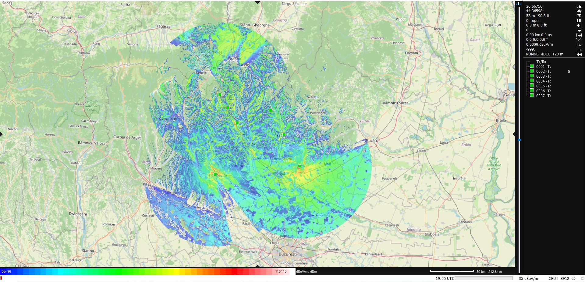
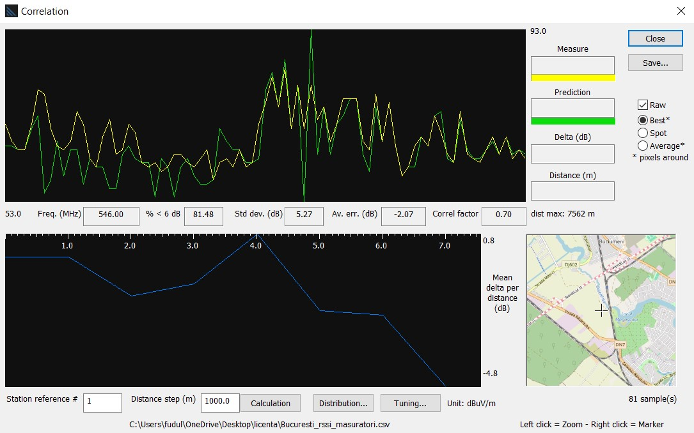

# DVB-T2 Coverage Analysis

## Overview

This repository contains the software developed as part of my Bachelor's thesis in Electronics and Telecommunications Engineering.

The project focuses on evaluating DVB-T2 radio coverage by comparing propagation model simulations performed in HTZ Communications with real field measurements. To collect the measurement data, I developed a Python application together with custom GNU Radio components for RSSI calculation and GPS data acquisition.

The collected measurements were processed and compared with the simulation results in order to evaluate the accuracy of different propagation models in both urban and rural environments.


## Project Objectives

- Perform DVB-T2 radio coverage simulations using HTZ Communications.
- Develop a measurement system based on SDR and GNU Radio.
- Collect RSSI and GPS data during field measurements.
- Compare simulation results with real measurements.
- Evaluate the performance of different propagation models.


## Technologies

- Python
- GNU Radio
- USRP B210
- GPS Receiver
- HTZ Communications
- DVB-T2

## Repository Structure

```
code/
```

Contains the Python source code developed for the project.

```
images/
```

Contains screenshots of the application, GNU Radio flowgraph, HTZ coverage maps and experimental setup.

```
results/
```

Contains sample measurement data.

```
docs/
```

Contains additional project documentation.


## Main Components

- Data collection application developed in Python.
- GNU Radio block for RSSI calculation.
- GPS module for location acquisition.
- Experimental measurement system based on SDR.

## Experimental Setup

The experimental measurement system consisted of a USRP B210 software-defined radio receiver, a GPS receiver and a laptop running GNU Radio and Python applications.



---

## Data Collection Application

A custom Python application was developed to collect and manage field measurement data, including GPS coordinates, RSSI values and additional information required during the measurement campaign.



---

## GNU Radio Flowgraph

The signal processing chain was implemented in GNU Radio. A custom Python block was developed for RSSI calculation and integrated into the flowgraph.



---

## Radio Coverage Simulation

Coverage predictions were generated using HTZ Communications based on the ITU-R P.1812 propagation model.

### Urban Scenario


### Rural Scenario



---

## Simulation vs. Measurements

The simulated signal levels were compared with the field measurements to evaluate the accuracy of the propagation model.



## About

Developed as part of my Bachelor's thesis in Electronics and Telecommunications Engineering.
